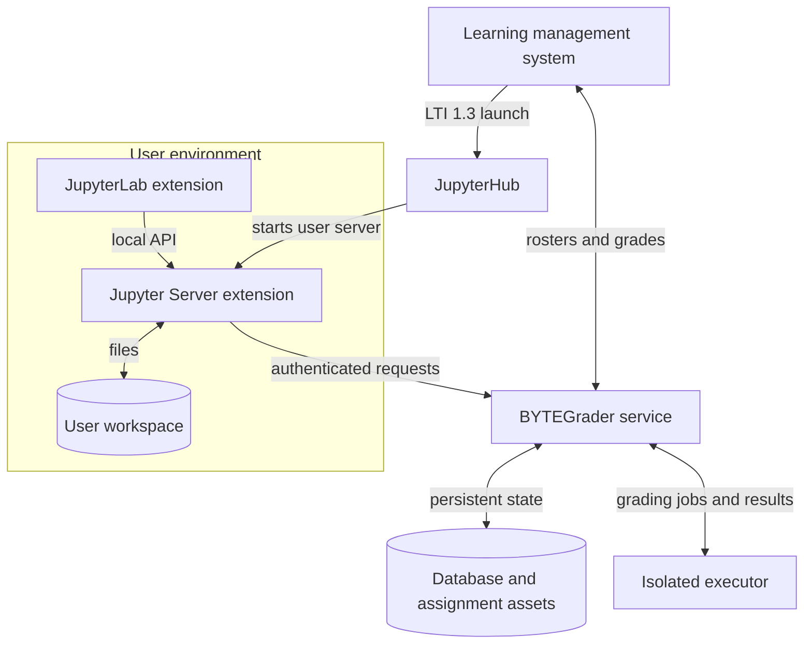

# Architecture

## Deployment overview

The browser never calls the central service directly. Requests go through the Jupyter Server extension, which authenticates them with the JupyterHub service token and performs workspace file operations locally.

## Components

### JupyterLab extension

The TypeScript extension contributes course and assignment widgets, Zustand-backed client state, an assignment wizard, and an overlay for editing nbgrader cell metadata. It calls the local Jupyter Server rather than the central service directly.

### Jupyter Server extension

The lab extension is both a proxy and a workspace adapter. It forwards JSON operations using the JupyterHub service token. Fetch operations unpack the service’s multipart response into the current workspace; creation and submission operations read selected local files and upload them as multipart requests.

### Central service

The Tornado service authenticates requests through `HubAuthenticated`. Repositories create a short-lived SQLAlchemy session for each operation. Database tables are currently created with `metadata.create_all()` at startup.

### Autograding

Submissions enter an in-memory `asyncio.Queue`. A configured number of workers reconstruct notebooks and invoke an executor. Results are stored as one `Grade` per notebook-submission and cell, after which the submission is marked graded and may be passed back to the LMS.