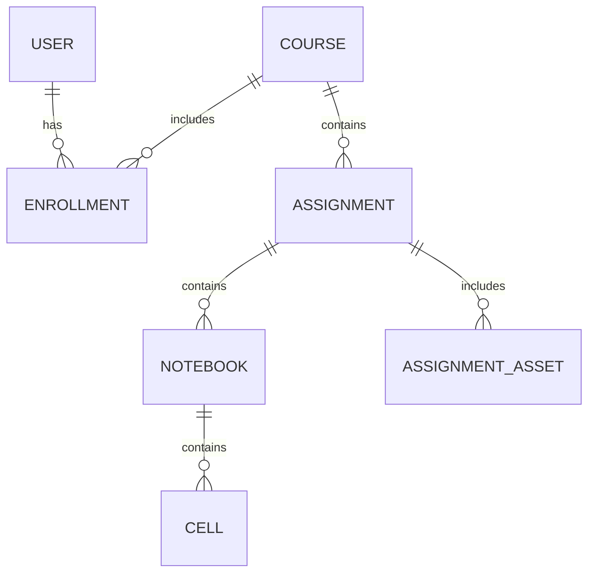
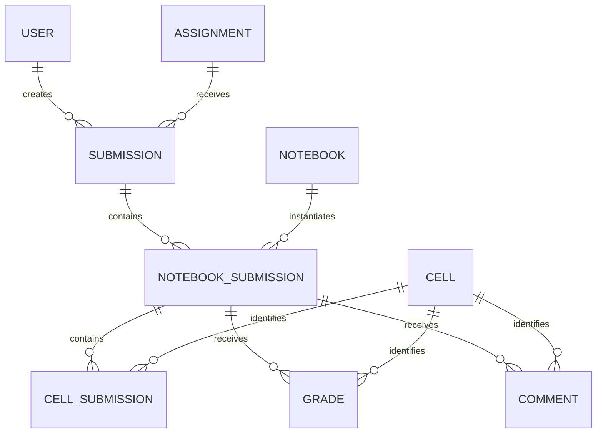

# Data model

## Course and assignment structure



`Enrollment` is the association between a user and a course. Everything that defines an assignment belongs to the course side of the model.

## Submission and grading structure



`NotebookSubmission` connects a student's submission to the original assignment notebook. Cell submissions, grades, and comments reference the original `Cell`, preserving the assignment's stable cell identity throughout grading.

## Courses and enrollment

`Course.label` is the primary key and is referenced by assignments and enrollments. A course may have an LMS context identifier. `Enrollment` joins users to courses with an instructor or student role and an active flag.

`User.id` and LMS identifiers are strings because identity values originate from JupyterHub and the LMS rather than from an internal sequence.

## Assignment definition

An `Assignment` belongs to a course and defines visibility, due date, late and resubmission behavior, solution policy, and optional LTI line-item ID.

Each `Notebook` stores its filename, ordering index, and serialized kernelspec. Its `Cell` rows store:

- the generated cell ID and order;
- cell type and display/grade name;
- instructor and student source variants;
- non-nbgrader metadata as JSON text;
- grading-role flags and maximum score.

Assignment assets keep the original relative path in the database while the body is stored under a generated ID in the asset directory.

## Submission and grading

A `Submission` belongs to one assignment and user. Its status is `submitted`, `graded`, or `archived`. Resubmission archives earlier active records.

`NotebookSubmission` connects a submission to each submitted assignment notebook. `CellSubmission` contains student source for recognized cells. `Grade` and `Comment` support automatic and manual values at cell level.

The final grade for a cell is:

```text
(manual score when present, otherwise automatic score or zero) + extra credit
```

Submission and notebook totals aggregate these cell grades. Due-date helpers account for per-submission extension days, although no public endpoint currently manages extensions.