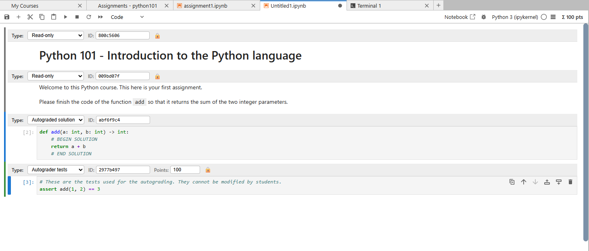

# Authoring notebooks

BYTEGrader follows nbgrader schema version 3 metadata. Assignment Creation Mode provides a UI for writing this metadata, but understanding the representation helps when reviewing notebooks or generating them programmatically.

You can author a new notebook for an assignment by creating a new notebook (`.ipynb`-file) in your JupyterLab and then selecting **BYTE Grader → Assignment Creation Mode**. With this above each cell in the notebook a new bar will appear where you can select the type of cell for the nbgrader format as well as the score for the graded cells.



## Cell metadata

```json
{
  "nbgrader": {
    "schema_version": 3,
    "grade": true,
    "solution": false,
    "locked": true,
    "task": false,
    "points": 2.0,
    "grade_id": "test-addition"
  }
}
```

| Combination | Meaning |
| --- | --- |
| `solution=true`, `grade=true` | Manually graded answer |
| `solution=true`, `grade=false` | Autograded student solution |
| `solution=false`, `grade=true` | Autograder test |
| `task=true` | Task cell, optionally containing a marking scheme |
| `locked=true` only | Read-only content |

## Solution regions

In a solution cell, wrap the instructor answer with delimiters:

```python
# BEGIN SOLUTION
def add(a, b):
    return a + b
# END SOLUTION
```

The distributed notebook replaces the region with a language-specific stub. If a cell is marked as a solution but has no delimited region, the entire source is replaced.

## Hidden tests

Hidden test regions must appear in a grade cell:

```python
assert add(1, 2) == 3
# BEGIN HIDDEN TESTS
assert add(-1, 1) == 0
# END HIDDEN TESTS
```

The hidden region is removed from the student copy but retained in the instructor source used during grading.

## Marking schemes

Task cells can include instructor-only guidance:

```markdown
Explain the complexity of your implementation.

BEGIN MARK SCHEME
Award one point for the correct complexity and one for the justification.
END MARK SCHEME
```

Marking-scheme regions are removed from the student copy. Attachments referenced from inside such a region are rejected by default because notebook attachments could leak the hidden material.

You can also use this reference here from nbgrader: <https://nbgrader.readthedocs.io/en/stable/user_guide/highlights.html#notebook-format>