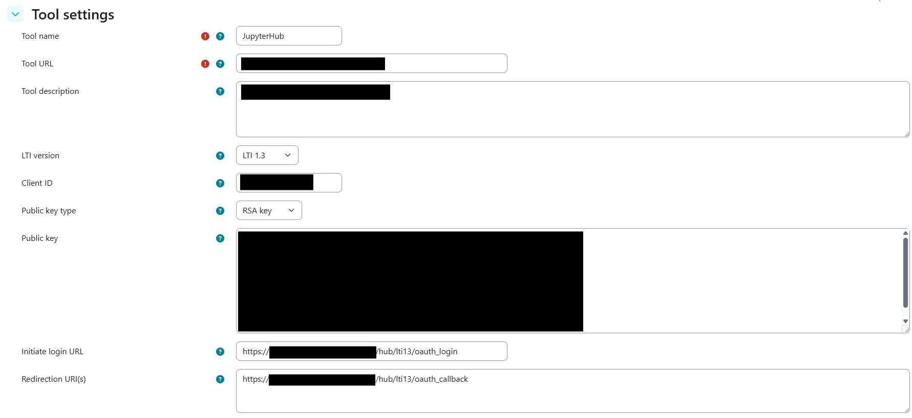

# Connect Moodle

The examples assume:

| Component | Example |
| --- | --- |
| Moodle | `https://moodle.example.org` |
| JupyterHub | `https://jupyter.example.org` |

Complete the [shared LTI preparation](index.md#prepare-the-signing-key) before continuing.

## 1. Register the external tool in Moodle

Open Moodle's external-tool administration and create a manual LTI 1.3 configuration.

### Tool settings

| Moodle field | Value |
| --- | --- |
| Tool URL | Public JupyterHub base URL, such as `https://jupyter.example.org` |
| LTI version | `LTI 1.3` |
| Public key type | `RSA key` |
| Public key | Contents of `/etc/bytegrader/public.pem` |
| Initiate login URL | `https://jupyter.example.org/hub/lti13/oauth_login` |
| Redirection URI | `https://jupyter.example.org/hub/lti13/oauth_callback` |




### Services

| Moodle service | Setting |
| --- | --- |
| IMS LTI Assignment and Grade Services | `Use this service for grade sync only` |
| IMS LTI Names and Role Provisioning | `Use this service to retrieve members' information as per privacy settings` |

### Privacy settings

- **Share launcher's name with tool:** `Always`
- **Accept grades from the tool:** `Always`
- **Force SSL:** enable for an HTTPS deployment

Save the tool. Open its registration details using the magnifying-glass icon and record:

- Client ID
- Public keyset URL (JWKS)
- Access token URL
- Authentication request URL

## 2. Configure the JupyterHub authenticator

Add the following to `/etc/jupyterhub/jupyterhub_config.py`, using the values displayed by Moodle:

```python
c.JupyterHub.authenticator_class = (
    "ltiauthenticator.lti13.auth.LTI13Authenticator"
)
c.Authenticator.allow_all = True
c.Authenticator.admin_users = {"<MOODLE-USER-ID-OF-ADMIN>"}

c.LTI13Authenticator.issuer = "https://moodle.example.org"
c.LTI13Authenticator.authorize_url = (
    "https://moodle.example.org/mod/lti/auth.php"
)
c.LTI13Authenticator.jwks_endpoint = (
    "https://moodle.example.org/mod/lti/certs.php"
)
c.LTI13Authenticator.client_id = ["<CLIENT-ID-FROM-MOODLE>"]
c.LTI13Authenticator.enable_auth_state = True
c.LTI13Authenticator.username_key = "sub"
```

`enable_auth_state` is required because BYTEGrader reads LTI context and identity values from JupyterHub when provisioning its local user record.

!!! warning "Verify the user identifier"

    Confirm with a test account that the `sub` claim used during login matches the `user_id` returned by Moodle's NRPS endpoint. A mismatch can create duplicate BYTEGrader users. The authenticator's default username key is `email`, which is not the intended identifier for this setup.

This configuration makes LTI the JupyterHub authenticator. Ordinary PAM login is no longer available in parallel.

## 3. Configure BYTEGrader's Moodle client

Extend `/etc/bytegrader/bytegrader_config.py`:

```python
from bytegrader.config.config import LTIConfig

lti = LTIConfig()
lti.enabled = True
lti.platform = "moodle"
lti.client_id = "<CLIENT-ID-FROM-MOODLE>"
lti.lms_url = "https://moodle.example.org"
lti.token_url = "https://moodle.example.org/mod/lti/token.php"
lti.key_path = "/etc/bytegrader/private.pem"
lti.lti_url = "https://moodle.example.org/mod/lti/services.php"
lti.nrps_url = "https://moodle.example.org/mod/lti/services.php"
lti.sync_task.enabled = True
lti.sync_task.interval = "5m"
c.BYTEGraderConfig.lti = lti
```

If Moodle displays different endpoint URLs in the registration details, use those values instead of the examples.

Protect the configuration and restart JupyterHub so both the authenticator and managed BYTEGrader service reload:

```bash
chmod 600 /etc/bytegrader/bytegrader_config.py
systemctl restart jupyterhub.service
journalctl -u jupyterhub.service -f
```

## 4. Verify the Moodle integration

1. Create a Moodle course and add the external tool as an activity.
2. Launch it as an administrator, instructor, and test student.
3. Confirm that each user reaches JupyterLab and sees the **BYTE Grader** menu.
4. Confirm that the Moodle course and roster synchronize into BYTEGrader.
5. Publish and submit a small test assignment.
6. Confirm that the grade appears in both BYTEGrader and Moodle.

For failures after a successful launch, see [LMS integration](../administration/lti.md) and [Troubleshooting](../troubleshooting.md).

## Further reading

- [LTIAuthenticator: LTI 1.3 Getting Started](https://jupyterhub-ltiauthenticator.readthedocs.io/en/latest/lti13/getting-started.html)
- [Moodle external tools](https://docs.moodle.org/en/External_tool)
